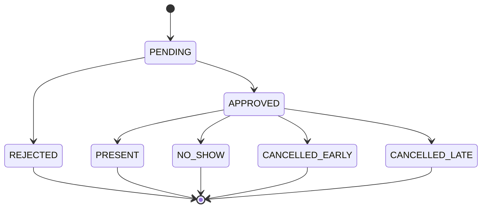
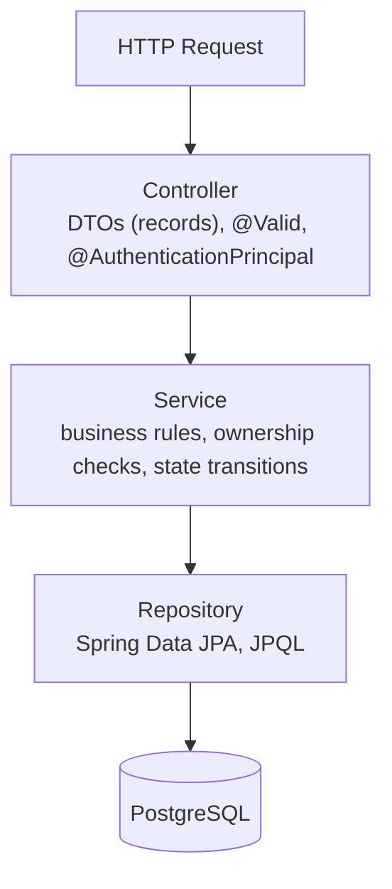
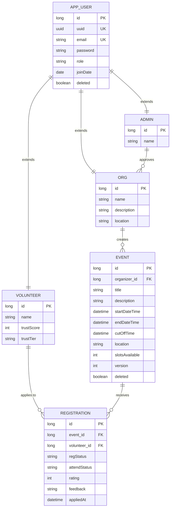
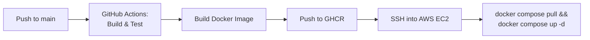

# TaraTulong

**Volunteer Management REST API**


> **TL;DR** — TaraTulong is a Spring Boot 4 REST API that models the volunteer-coordination workflow end to end: JWT-based RBAC across three roles, a registration state machine, concurrency-safe event capacity via optimistic locking, and a point-delta trust-scoring system that replaced a fragile "recalculate everything" approach. Deployed on **AWS EC2** via **Docker Compose**, with a full **GitHub Actions CI/CD pipeline** building, testing, and redeploying on every push to `main`.

## Live Demo

- **Swagger UI:** `http://13.251.90.175:8080/swagger-ui.html`
- **Base API URL:** `http://13.251.90.175:8080/api/v1`

## Highlights

- Modeled a five-state registration lifecycle as an explicit state machine rather than loose strings — every transition triggers slot, trust-score, and attendance-stat updates
- Fixed a real concurrency bug (two orgs approving the last event slot at once) using JPA optimistic locking, turning a raw 500/stack-trace into a clean `409 Conflict`
- Designed a point-delta trust score so attendance *corrections* are idempotent — no need to replay history when an org fixes a mistaken no-show
- Closed an IDOR gap by adding explicit resource-ownership checks in the service layer, on top of Spring Security's role checks
- Solved an N+1 query problem on the event-registrations list with `JOIN FETCH` plus a dedicated `countQuery`
- Shipped a complete CI/CD pipeline: GitHub Actions tests the build, pushes an image to GHCR, and redeploys to AWS EC2 automatically

---

## The Problem

Many grassroots organizations — student councils, school clubs, local NGOs, community groups — coordinate volunteer opportunities through Facebook groups, Google Forms, spreadsheets, and messaging apps. This creates recurring problems:

- No centralized view of who has applied, been approved, or attended
- No way to track volunteer reliability across events
- No capacity enforcement — events can be silently overbooked
- No distinction between a responsible early cancellation and a no-show
- Race conditions when two people try to claim the last available slot

TaraTulong models that coordination workflow as a proper backend system with role-based access, state-managed registrations, attendance tracking, and a reputation-scoring algorithm.

The idea came from firsthand experience organizing reading tutorials for students at Macanhan Elementary School, where I saw how volunteer coordination breaks down without structure.

---

## Key Features

### Registration State Machine

Volunteer applications move through explicit states rather than arbitrary string values:



Each transition triggers downstream effects — slot count adjustments, trust score updates, and attendance statistics recalculation.

### Trust Score Algorithm

Volunteer reliability is calculated using a **point delta system** rather than a simple attendance percentage.

| Outcome | Points |
|---|---:|
| `PRESENT` | +10 |
| `CANCELLED_EARLY` | -2 |
| `CANCELLED_LATE` | -10 |
| `NO_SHOW` | -25 |

The key design decision: when an organization **corrects** an attendance record (e.g., marking a `NO_SHOW` as `PRESENT`), the system calculates the delta between the old and new states:

```text
New points = newStatus.pointValue - currentStatus.pointValue
           = PRESENT(+10) - NO_SHOW(-25)
           = +35 correction
```

This makes corrections safe and idempotent — the score always reflects the current state regardless of how many times it was changed. The accumulated score maps to a human-readable **Trust Tier** (Platinum → Gold → Silver → Bronze → High Risk) via a custom MapStruct mapping.

### Early vs Late Cancellation

Cancellations are classified based on a **48-hour threshold** before the event start:

```java
AttendanceStatus cancelStatus = now.plusHours(48).isBefore(eventStartDateTime)
        ? AttendanceStatus.CANCELLED_EARLY   // -2 points
        : AttendanceStatus.CANCELLED_LATE;   // -10 points
```

This lets the system distinguish *"I cancelled with enough notice for the org to find a replacement"* from *"I cancelled at the last minute."*

### Capacity Management with Optimistic Locking

Events have a `slotsAvailable` counter that decrements on approval and increments if an approved registration is rejected or cancelled. The `Event` entity uses a JPA `@Version` field to prevent concurrent approvals from over-allocating the last slot. If two approval requests race, the second receives a `409 Conflict`, caught globally via `@ControllerAdvice` handling `ObjectOptimisticLockingFailureException`.

**Example — two orgs approve the same registration at once:**

```bash
curl -X PATCH https://<host>/api/v1/registrations/42/status/approved \
  -H "Authorization: Bearer <org_jwt>"
```

The request that loses the race gets:

```json
{
  "timeStamp": "2026-08-08T10:30:01",
  "status": 409,
  "error": "Conflict",
  "message": "The resource was modified. Refresh and try again",
  "path": "/api/v1/registrations/42/status/approved"
}
```

### IDOR Prevention

Authorization goes beyond role checks. The service layer verifies **resource ownership** before allowing operations:

```text
Org user hits PATCH /registrations/42/status/approved
  → Spring Security: Is this user an ORG? ✓
  → Service layer: Does this org own the event tied to registration 42? ✓ or 403
```

This prevents insecure direct object reference (IDOR) attacks where an organization could modify another organization's events by changing the ID in the request.

### Soft Deletes

Users and events are soft-deleted using Hibernate 6's `@SQLRestriction("deleted=false")`. Deleted volunteers have their email mangled (`DELETED_<email>_<timestamp>`) to free the unique constraint for re-registration.

---

## Tech Stack

| Layer | Technology |
|---|---|
| Language | Java 21 |
| Framework | Spring Boot 4 |
| Security | Spring Security + JWT (jjwt 0.11.5) |
| Persistence | Spring Data JPA / Hibernate 6 |
| Database | PostgreSQL |
| Migrations | Flyway |
| Object Mapping | MapStruct 1.5.5 |
| Validation | Jakarta Bean Validation |
| API Docs | OpenAPI 3 / Swagger UI (springdoc) |
| Testing | JUnit 5 + Mockito |
| Build | Maven |
| Containerization | Docker, Docker Compose |
| CI/CD | GitHub Actions → AWS EC2 |

---

## Architecture



**Package structure is organized by feature** (event, registration, user, security) rather than by technical layer. Each feature contains its entity, service, repository, and a `v1/` subpackage with the controller and DTOs.

**DTOs use Java Records** at the API boundary — request DTOs carry validation annotations, response DTOs expose only the fields the client needs. MapStruct handles the mapping between entities and DTOs, including custom logic like the trust-tier calculation.

**JPA inheritance** — `AppUser` is the base entity (`InheritanceType.JOINED`), extended by `Volunteer`, `Org`, and `Admin`. This was chosen over `SINGLE_TABLE` to avoid nullable columns and keep each role's data normalized, at the cost of requiring joins for polymorphic queries.

---

## Data Model



- `Org` → `Event`: one-to-many (an org creates events)
- `Volunteer` → `Registration` → `Event`: many-to-many through `Registration`
- `Admin` → `Org`: one-to-many (admin approves organizations)
- All relationships are `FetchType.LAZY` by default — eager loading only via explicit `JOIN FETCH` queries

---

## Security

| Concern            | Implementation                                                      |
| ------------------ | ------------------------------------------------------------------- |
| Authentication     | Stateless JWT (HS256, 24h expiry) via custom `OncePerRequestFilter` |
| Password storage   | BCrypt via Spring Security's `PasswordEncoder`                      |
| Role-based access  | `ADMIN`, `ORG`, `VOLUNTEER` enforced in `SecurityFilterChain`       |
| Resource ownership | Service-layer checks before mutation operations                     |
| CSRF               | Disabled (stateless JWT, no cookies)                                |
| CORS               | Configured for `localhost:3000` (development)                       |
| Session            | `STATELESS` — no server-side session                                |

---

## Error Handling

All exceptions are caught by a `@ControllerAdvice` handler and returned in a consistent structure:

```json
{
  "timeStamp": "2026-08-08T10:30:00",
  "status": 409,
  "error": "Conflict",
  "message": "Registration already approved.",
  "path": "/api/v1/registrations/42/status/approved"
}
```

| Exception | HTTP Status | When |
|---|---|---|
| `BaseNotFoundException` subclasses | 404 | Entity not found |
| `UserAlreadyExistsException` | 409 | Duplicate email on registration |
| `VolunteerAlreadyRegisteredException` | 409 | Duplicate event registration |
| `RegistrationConflictException` | 409 | Invalid state transition |
| `EventRegistrationClosed` | 400 | Past cutoff or no slots |
| `ObjectOptimisticLockingFailureException` | 409 | Concurrent modification detected |
| `MethodArgumentNotValidException` | 400 | Bean validation failures (field-level messages) |
| `UnauthorizedAccessException` | 403 | Resource ownership check failed |

Validation errors extract field-level messages from `BindingResult` rather than returning raw framework exceptions.

---

## API Endpoints

### Authentication
| Method | Endpoint | Auth | Description |
|---|---|---|---|
| POST | `/api/v1/auth/login` | Public | Returns JWT token |

### Events
| Method | Endpoint | Auth | Description |
|---|---|---|---|
| GET | `/api/v1/events` | Public | List all events (paginated, sorted by date) |
| GET | `/api/v1/events/{id}` | Public | Get event details |
| GET | `/api/v1/events/org/{orgId}` | Public | Events by organization (paginated) |
| POST | `/api/v1/events` | ORG | Create event |
| PUT | `/api/v1/events/{id}` | ORG (owner) | Update event |
| DELETE | `/api/v1/events/{id}` | ORG (owner) | Soft delete event |

### Registrations
| Method | Endpoint | Auth | Description |
|---|---|---|---|
| POST | `/api/v1/registrations` | VOLUNTEER | Apply to an event |
| GET | `/api/v1/registrations/{id}` | Authenticated | Get registration |
| GET | `/api/v1/registrations/events/{eventId}` | ORG (owner) | List registrations for an event |
| PATCH | `/api/v1/registrations/{id}/status/approved` | ORG (owner) | Approve registration (decrements slots) |
| PATCH | `/api/v1/registrations/{id}/status/rejected` | ORG (owner) | Reject registration |
| PATCH | `/api/v1/registrations/{id}/present` | ORG (owner) | Mark as present |
| PATCH | `/api/v1/registrations/{id}/absent` | ORG (owner) | Mark as no-show |
| PATCH | `/api/v1/registrations/{id}/cancel` | VOLUNTEER (owner) | Cancel registration |
| PATCH | `/api/v1/registrations/{id}/feedback` | ORG (owner) | Rate volunteer (1-5) + feedback |
| DELETE | `/api/v1/registrations/{id}` | VOLUNTEER (owner) | Delete registration |

### Users
| Method | Endpoint | Auth | Description |
|---|---|---|---|
| POST | `/api/v1/volunteers` | Public | Register volunteer |
| GET | `/api/v1/volunteers/me` | VOLUNTEER | Get own profile |
| PUT | `/api/v1/volunteers/me` | VOLUNTEER | Update profile |
| DELETE | `/api/v1/volunteers/me` | VOLUNTEER | Soft delete account |
| POST | `/api/v1/orgs` | Public | Register organization |
| GET | `/api/v1/orgs/{id}` | Public | View organization |
| PATCH | `/user/password` | Authenticated | Change password |
| PATCH | `/user/email` | Authenticated | Change email |

### Admin
| Method | Endpoint | Auth | Description |
|---|---|---|---|
| PATCH | `/api/v1/admin/me/approve/{orgId}` | ADMIN | Approve organization |
| PATCH | `/api/v1/admin/me/reject/{orgId}` | ADMIN | Reject organization |

Full interactive docs available via **Swagger UI** at `/swagger-ui.html` after starting the application.

---

## Database Performance

- **Indexes** on `registration.event_id` and `registration.volunteer_id` (defined via `@Table(indexes = ...)` on the `Registration` entity)
- **`FetchType.LAZY`** on all `@ManyToOne` and `@OneToMany` relationships
- **`JOIN FETCH`** with a dedicated `countQuery` for the paginated registrations-by-event query — avoids both N+1 queries and the Hibernate pagination-with-fetch-join issue
- **Pagination** on all list endpoints using Spring Data's `Pageable` with configurable size and sort

---

## Testing

Unit tests cover the service layer using **JUnit 5** and **Mockito**. Repository and Spring context dependencies are fully mocked so tests run fast and without a database.

```bash
./mvnw test
```

| Service | What's Tested |
|---|---|
| `RegistrationService` | Registration lifecycle (save, approve, reject, delete), slot decrement/restore on approval and rejection, early vs late cancellation based on the 48-hour threshold, trust-score point-delta algorithm, rating and feedback validation, ownership guards for both orgs and volunteers |
| `EventService` | Event CRUD, date-range validation (start must precede end), org ownership verification on updates and deletes |
| `VolunteerService` | Volunteer registration with password encoding, duplicate-email prevention, profile updates, trust-score and attendance-stat delta methods |
| `OrgService` | Organization registration with password encoding, duplicate-email prevention, re-registration after soft delete, profile updates |
| `AdminService` | Admin creation, org approval/rejection status transitions, duplicate-email handling with soft-delete awareness |
| `AppUserService` | Email change with uniqueness enforcement, password change with current-password verification, soft-delete (email mangling + password scrubbing) |
| `AuthService` | JWT token generation on successful login, `BadCredentialsException` propagation on invalid credentials |

Tests follow the **Arrange → Act → Assert** pattern with `@Nested` classes grouping tests by method under test, and `@DisplayName` annotations for readable test output.

---

## Getting Started

### Prerequisites

- Java 21
- Maven
- PostgreSQL

### Environment Variables

The application reads all connection and security settings from environment variables. Create a `.env` file in the project root (one is provided as a template):

| Variable | Description |
|---|---|
| `DB_HOST` | PostgreSQL host |
| `DB_PORT` | PostgreSQL port |
| `DB_NAME` | Database name |
| `DB_USERNAME` | Database user |
| `DB_PASSWORD` | Database password |
| `JWT_SECRET` | Base64-encoded secret key for JWT signing (HS256) |

### Local Setup (without Docker)

```bash
# Clone
git clone https://github.com/<your-username>/TaraTulong.git
cd TaraTulong

# Create the database
psql -U postgres -c "CREATE DATABASE taratulong_db;"

# Set environment variables (or populate .env and source it)
export DB_HOST=localhost
export DB_PORT=5432
export DB_NAME=taratulong_db
export DB_USERNAME=postgres
export DB_PASSWORD=<your_password>
export JWT_SECRET=<your-base64-encoded-secret>

# Build (skip tests if no database is available yet)
./mvnw clean package -DskipTests

# Run
./mvnw spring-boot:run
```

The API starts at `http://localhost:8080`. Swagger UI is at `http://localhost:8080/swagger-ui.html`.

### Running Locally with Docker Compose

The project ships with a multi-stage `Dockerfile` and a `docker-compose.yml` that runs **both** the API and PostgreSQL — this is the exact same stack used in production (see [Deployment](#deployment) below).

**Dockerfile** — two-stage build:
1. **Builder stage** — `maven:3.9.6-eclipse-temurin-21` resolves dependencies and packages the JAR
2. **Runtime stage** — `eclipse-temurin:21-jre-alpine` runs the JAR on a minimal image

```bash
# Build and start both containers
docker compose up --build -d

# View logs
docker compose logs -f taratulong_api

# Stop
docker compose down
```

| Service | Detail |
|---|---|
| `taratulong_db` | PostgreSQL 15 Alpine, port `5432`, data persisted in a `pg_data` named volume |
| `taratulong_api` | Built from the `Dockerfile`, port `8080`, connects to `taratulong_db` over the `taratulong_network` bridge |

The `DB_HOST` inside the API container is overridden to `taratulong_db` (the Docker service name), so the `.env` value of `localhost` is only used for local development outside Docker.

---

## Deployment

TaraTulong runs on a single **AWS EC2** instance using the same `docker-compose.yml` stack described above — the API and PostgreSQL containers ship together, so there's no separate managed-database dependency to provision.



A GitHub Actions workflow at `.github/workflows/ci.yml` runs on every push to `main` or `develop` and on pull requests targeting `main`.

| Stage | What it does |
|---|---|
| **Build & Test** | Spins up a PostgreSQL 15 service container, sets up Java 21 (Temurin), caches Maven dependencies, and runs `./mvnw test` |
| **Docker Build & Push** | Builds the Docker image, tags it with the short commit SHA, and pushes it to **GitHub Container Registry** (`ghcr.io`) |
| **Deploy** | SSHs into the AWS EC2 instance, pulls the newly tagged image, and restarts the `taratulong_api` service via Docker Compose |

The deploy job runs only after a successful build-and-test, and uses repository secrets for SSH credentials and host configuration — no credentials are stored in the workflow file itself.

---

## Project Status

### Implemented

- REST API with versioned endpoints (`/api/v1/`)
- PostgreSQL persistence with Spring Data JPA / Hibernate 6
- Database migrations with Flyway
- JWT authentication with stateless sessions
- Role-based access control (Admin, Organization, Volunteer)
- Event CRUD with capacity management
- Registration workflow with state transitions
- Attendance tracking with early/late cancellation differentiation
- Trust Score algorithm with point deltas and tier mapping
- Optimistic locking for concurrent slot management
- DTO-based API boundary with MapStruct
- Global exception handling with consistent error responses
- Bean validation on all request DTOs
- Database indexing on foreign keys
- OpenAPI 3 / Swagger UI documentation
- Soft deletes with `@SQLRestriction`
- Organization approval workflow (Admin → Org)
- CORS configuration
- Unit tests (JUnit 5 + Mockito) across all service classes
- Docker containerization with multi-stage builds
- Docker Compose for local full-stack development
- CI/CD pipeline (GitHub Actions) — test, build, push, and deploy to AWS EC2

### Planned

- Email notifications
- Event search and filtering
- Waitlist management

---

## Challenges and Lessons Learned

**Concurrent slot management** was the most technically interesting problem. Initially I didn't account for two simultaneous approvals claiming the last slot. Adding `@Version` to the `Event` entity solved this, but I also had to handle the resulting exception at the API layer — returning a meaningful 409 instead of a 500 with a Hibernate stack trace.

**The point delta algorithm** went through several iterations. My first approach stored trust scores as absolute values recalculated from scratch on every update. This was expensive and fragile. The current delta-based approach (`newStatus.points - currentStatus.points`) handles corrections naturally — if an org accidentally marks a volunteer as `NO_SHOW` and then corrects it to `PRESENT`, the math self-corrects without needing to replay the entire history.

**Soft deletes and unique constraints** were a practical annoyance. When a user is soft-deleted, their email still occupies the unique constraint. Mangling the email with a `DELETED_` prefix and timestamp was the pragmatic solution, though a proper approach might use a partial unique index in PostgreSQL.

**JPA inheritance trade-offs** became apparent as the project grew. `JOINED` inheritance keeps data clean but means every `AppUser` query requires joins across the `volunteer`, `org`, and `admin` tables. For this project's scale, the trade-off is reasonable; at production scale, I would consider whether `SINGLE_TABLE` with discriminator columns would perform better for auth-heavy query patterns.

**The N+1 problem** appeared when listing registrations for an event — each registration lazily loaded its volunteer and event, generating dozens of queries for a single page. The `JOIN FETCH` with separate `countQuery` in the repository solved this, but I learned that fixing N+1 isn't just about adding `EAGER` everywhere — it's about making fetch behavior intentional per query.

---

## What This Project Demonstrates

- Designing REST APIs around **domain workflows** rather than database tables
- Modeling **state transitions** with enums and enforcing valid transitions in the service layer
- Implementing **JWT authentication and RBAC** with Spring Security
- Preventing **IDOR vulnerabilities** through service-layer ownership verification
- Solving the **N+1 query problem** with `JOIN FETCH` and `countQuery`
- Using **optimistic locking** to handle concurrent updates
- Building a **consistent error handling** strategy with `@ControllerAdvice`
- Separating **persistence models from API contracts** using DTOs and MapStruct
- Making **database performance decisions** (indexes, fetch strategies, pagination) based on query patterns
- Writing **focused unit tests** with Mockito to verify business logic in isolation
- **Containerizing** a Spring Boot application with Docker and Docker Compose
- Deploying to **AWS EC2** with a full GitHub Actions CI/CD pipeline
- Understanding that backend engineering is about ensuring the system remains correct when users, requests, and data interact in ways the happy path doesn't anticipate

---

## Contact

Built by **Francis Joshua Gacutno** — [francisjoshuagacutno@gmail.com](mailto:francisjoshuagacutno@gmail.com) · [LinkedIn](https://www.linkedin.com/in/francis-joshua-gacutno-518470372/) · [GitHub](https://github.com/frnsjshh)
